# LangSecret — System Architecture, Database Design & Core Algorithms

> This repository is a **showcase** of the system architecture, database schema (25+ models), core algorithms, and technical decisions behind [LangSecret](https://langsecret.com) — an EdTech platform for learning English vocabulary through spaced repetition, adaptive reading, and gamification.
>
> The production source code is **private**. This repo contains only documentation and architectural descriptions — no source code, no credentials.

---

## Live Product

**https://langsecret.com** — English learning platform with vocabulary training, adaptive reading with parallel translation, and gamification.

| Word Cards | Reading with Translation | User Profile |
|:-:|:-:|:-:|
|  |  |  |

> **To display screenshots:** create a `screenshots/` folder next to this README and add 3 PNG files (see paths below).

---

## Tech Stack

| Layer | Technology |
|-------|-----------|
| **Backend** | Python 3.12, Flask 3.1, Flask Blueprints |
| **ORM** | SQLAlchemy 2.0, Flask-SQLAlchemy 3.1 |
| **Database** | MySQL 8 (via mysqlclient 2.2) |
| **Auth** | Flask-Bcrypt 1.0, Telegram OAuth, token-based email activation & password reset |
| **NLP** | BNC/CEFR-J frequency lists, wordfreq Zipf scores (offline content preparation) |
| **AI/LLM** | OpenAI-compatible API (DeepSeek via OpenRouter), Pydantic-validated responses, Fernet-encrypted API keys |
| **Visualization** | Matplotlib 3.10 (server-side charts — bar charts, ring/progress SVGs) |
| **Media** | Pillow 11.1 (image processing, thumbnails, watermarks, social share cards) |
| **TTS** | Qwen3-TTS 1.7B (standalone PySide6 desktop generator, not in web app) |
| **Games** | JavaScript (Rocket mini-game) |
| **Frontend** | Jinja2 templates, PWA (manifest.json, service-worker.js) |
| **Deployment** | Gunicorn 20.1, Nginx reverse proxy |
| **Admin** | Flask-Admin 1.6 (darkly theme, IP-restricted) |
| **Email** | Flask-Mail 0.9 (local Postfix), newsletter system with Telegram integration |

---

## Core Algorithms

### 1. SM-2 Spaced Repetition

Implements the [SuperMemo-2 algorithm](https://supermemo.guru/wiki/SuperMemo_1.0_for_DOS_(1987)#Algorithm_SM-2) with extensions for vocabulary review.

**Input:** quality (0–5), current `easiness_factor`, current `interval`, `repetitions`

**On failure (quality < 3):**

| Quality | Action |
|---------|--------|
| 0–1 | Repeat today (`interval = 0`) |
| 2 | Repeat tomorrow (`interval = 1`) |

```
repetitions = 0
new_ef = max(1.3, current_ef - 0.2)
```

**On success (quality >= 3):**

```
new_ef = current_ef + 0.1 - (5 - quality) * (0.08 + (5 - quality) * 0.02)
new_ef = clamp(new_ef, 1.3, 2.5)

repetitions=0 → interval = 1 day
repetitions=1 → interval = 6 days
repetitions≥2 → interval = round(current_interval * new_ef)

If quality == 5: interval *= 1.3  (perfect answer bonus)
repetitions += 1
```

**5 Review Modes:** flashcard, typing, multiple choice, listening, matching. Users can set preferred mode per word or use `auto`.

**Mastery Criteria:** A word transitions to `status = mastered` when its SM-2 interval exceeds a threshold and the user has demonstrated consistent recall.

**Review History Tracking:** Every review records `easiness_factor_before/after` and `interval_before/after` for analytics.

---

### 2. Smart Word Selection

When generating a test set of 20 cards, the algorithm balances **new words** vs **repeats** based on the user's collection size:

| Collection Size | Repeats | New |
|----------------|---------|-----|
| < 100 | 0 | 20 |
| 100–399 | 4 | 16 |
| 400–699 | 8 | 12 |
| 700–999 | 12 | 8 |
| 1000–1499 | 16 | 4 |
| 1500+ | 18 | 2 |

**Repeat priority weights** (lower level = higher priority):

| Word Level | Weight |
|-----------|--------|
| 1–2 | 5x |
| 3–4 | 3x |
| 5–9 | 2x |
| 10+ | 1x |

Selection uses weighted random sampling **without replacement**, implemented via `weighted_random_sample()`.

**Typing answer validation:** Exact match → quality 5. Levenshtein distance <= 1 (short words) or <= 2 (5+ chars) → quality 3 (typo tolerance). Otherwise → quality 0.

---

### 3. Content Pipeline for Reading Module

Reading texts are prepared **offline** before publication. The pipeline does not use spaCy at runtime — all lemmas, POS tags, and translations are pre-generated by LLM and stored directly.

**Content preparation (offline):**

1. **LLM generation:** ChatGPT/DeepSeek processes raw English text and produces a JSON with:
   - `sentences`: array of `{en, ru}` parallel sentence pairs
   - `words`: array of `{word, lemma, pos, transcription, translation_lemma, translation_context, sentence_index, word_index}`
2. **`TextProcessor` import:** The Flask app imports the ready-made JSON into the database — no NLP processing at runtime. Two formats supported: compact (by index) and legacy (by full sentence text)
3. **Storage:** Sentences stored in `ReadingText.content_pairs` (JSON), words in `ReadingTextWord` table with `word_lemma`, `pos_tag`, `transcription` (IPA), and sentence context for tooltip display

**CEFR level assignment (offline script):**

`bnc_vocab_loader.py` is an **offline utility** (not part of the running app) that assigns CEFR levels to words using a 3-tier priority system:
- Priority 1: Manual overrides (78 curated modern words)
- Priority 2: CEFR-J Wordlist v1.6
- Priority 3: `wordfreq` Zipf frequency — thresholds: >=5.7 → A1, >=5.1 → A2, >=4.5 → B1, >=3.8 → B2, below → C1

**AI-assisted analysis (runtime):**

LLM (DeepSeek V4 Flash via OpenRouter) performs on-demand sentence-level grammatical analysis when users click words in reading mode. Results cached in `SentenceAnalysis` with `cache_key` (SHA-256). Rate-limited to 50 requests/user/day via `UserAICounters`. Users can also ask follow-up questions stored in `AnalysisQuestion`.

---

### 4. Gamification System

**Level Thresholds** — exponential curve:

```
points_for_level(n) = int(1200 * 1.035^(n-1) - 1200)
```

| Level | Points Required |
|-------|----------------|
| 1 | 0 |
| 2 | 42 |
| 5 | 165 |
| 10 | 413 |
| 20 | 1,279 |
| 50 | 4,518 |
| 100 | 7,735 |

**Active Day:** 5+ points earned in a day = active day (recorded in `UserActivity`).

**Streak Calculation:** Sort active dates descending. Must start from today or yesterday (otherwise streak = 0). Count consecutive dates backward.

**Daily Ring Progress (SVG):** `offset = circumference * (1 - min(daily_points, 5) / 5)`

**Achievement Categories:** Cards, Levels, Correct Answers, Active Days, Streaks, and more.

---

## Database Architecture

### High-Level ER Diagram

```mermaid
erDiagram
    User ||--o{ UserWordProgress : "vocabulary progress"
    User ||--o{ UserAttempts : "test attempts"
    User ||--o{ UserActivity : "daily activity"
    User ||--o{ UserLastActivity : "last seen"
    User ||--o{ UserAchievement : "achievements"
    User ||--o{ PointLog : "points history"
    User ||--o{ UserLogin : "login log"
    User ||--o{ Notification : "notifications"
    User ||--o{ Friendship : "friends"
    User ||--o{ UserReadingProgress : "reading progress"
    User ||--o{ UserReadingStats : "reading stats"
    User ||--o{ UserVocabulary : "personal vocabulary"
    User ||--o{ VocabularyReviewHistory : "review history"
    User ||--o{ GameSession : "game sessions"
    User ||--o{ Article : "authored articles"
    User ||--o{ ArticleComment : "comments"

    WordCard ||--o{ UserWordProgress : "progress"
    WordCard ||--o{ UserAttempts : "attempts"
    WordCard }o--o{ WordTopic : "categorized"

    ReadingCategory ||--o{ ReadingText : "contains"
    ReadingText ||--o{ ReadingTextWord : "words"
    ReadingText ||--o{ UserReadingProgress : "progress"
    ReadingText ||--o{ SentenceAnalysis : "AI analysis"

    UserVocabulary ||--o{ VocabularyReviewHistory : "review log"

    ArticleCategory ||--o{ Article : "contains"
    Article }o--o{ ArticleTag : "tagged"
    Article ||--o{ ArticleComment : "comments"
    Article ||--o{ ArticleImage : "images"

    Achievement ||--o{ UserAchievement : "earned by"

    LLMProvider ||--o{ SentenceAnalysis : "generates"
```



### Model Groups

| Group | Models | Key Fields | Notes |
|-------|--------|------------|-------|
| **User Core** | `User`, `ActivationToken`, `PasswordResetToken`, `UserLogin`, `UnsubscribeToken` | `email`, `username`, `telegram_id`, `oauth_provider`, `level`, `total_points` | OAuth (Telegram), bcrypt password hashing, SHA-256 token hashing, 24h/1h expiry |
| **Progress & Vocabulary** | `UserWordProgress`, `UserAttempts`, `UserVocabulary`, `VocabularyReviewHistory` | Composite PK `(user_id, word_id)`, SM-2 fields (`easiness_factor`, `interval_days`, `repetitions`) | `cascade='all, delete-orphan'` on User; `preferred_review_mode` enum |
| **Reading / NLP** | `ReadingCategory`, `ReadingText`, `ReadingTextWord`, `UserReadingProgress`, `UserReadingStats`, `SentenceAnalysis`, `LLMProvider`, `UserAICounters`, `AnalysisQuestion` | `content_pairs` (JSON), `word_lemma`, `pos_tag`, `cache_key` (SHA-256) | `ReadingCategoryLevelSEO` for per-level SEO pages |
| **Social / Notifications** | `Friendship`, `Notification`, `UserCongratulations`, `Achievement`, `UserAchievement` | `status` enum (pending/accepted/rejected), `is_system` flag | Friends graph with bilateral lookup |
| **CMS** | `Article`, `ArticleCategory`, `ArticleTag`, `ArticleComment`, `ArticleImage`, `Page`, `WordCard`, `WordTopic`, `WordPageSEO` | `slug`-based URLs, thumbnail sizes (small/medium/large), SEO fields | Moderation workflow for comments; Matplotlib server-side chart generation |
| **Gamification** | `GameSession`, `RocketGuessedWord`, `RocketMissedWord`, `PointLog`, `LevelNotifications`, `UserLevelNotification` | `game_type`, `tier_reached`, `points_change`, `source_type` | Rocket mini-game with tier-based difficulty |
| **Newsletter** | `EmailCampaign`, `EmailCampaignRecipient` | `status` enum (draft/sending/paused/completed/cancelled), `filter_json` | Throttled sending with `send_delay_seconds` |

---

## API & Modular Structure

### Blueprint Registry

| Blueprint | URL Prefix | Key Endpoints | Purpose |
|-----------|-----------|---------------|---------|
| `routes` | `/` | `/`, `/learn-english/`, `/learn-english/test`, `/learn-english/results` | Home, word test, results |
| `auth_bp` | `/` | `/login`, `/register`, `/activate/<token>`, `/reset_password`, Telegram OAuth | Authentication & OAuth |
| `profile_bp` | `/` | `/@<username>`, `/update_avatar`, `/load_wordcards` | User profile & data loading |
| `stats_bp` | `/api/` | `/api/points_history`, `/api/activity_history`, `/api/speed_history` | Statistics API (AJAX) |
| `social_bp` | `/api/` | `/api/congratulate`, `/api/friend/*`, `/api/active-users` | Social interactions |
| `notifications_bp` | `/api/` | `/api/notifications`, `/api/notifications/mark-read/<id>` | Notification system |
| `reading_bp` | `/reading/` | `/reading/<cat>/<text>`, `/reading/vocabulary/`, `/reading/api/*` | Reading module & vocabulary review |
| `english_words_bp` | `/english-words/` | `/english-words/`, `/english-words/<slug>`, `/english-words/letter/<l>/` | Word catalog with SEO pages |
| `articles_bp` | `/` | `/<cat_slug>/<article_slug>`, `/search`, `/sitemap.xml` | Article CMS |
| `games_bp` | `/games/` | `/games/rocket`, `/api/rocket/submit`, `/api/rocket/rating` | Rocket mini-game |
| `newsletter_bp` | `/` | `/unsubscribe/<token>`, `/profile/toggle_newsletter` | Newsletter management |
| `pages_bp` | `/` | `/contact/`, `/<slug>/` | Static pages |

---

## Architectural Patterns

### Context Processors

`inject_level_progress()` runs on **every request**, computing: current level, total_points, points_to_next_level, progress_percentage, active_streak, daily_points (for ring SVG offsets), collected_cards, texts_completed, and pending level-up notifications. This data is available in all Jinja2 templates.

### Server-Side Chart Generation

**Matplotlib** generates PNG charts server-side (no client-side chart libraries needed):
- Bar charts: correct/incorrect answers per session
- Circle charts (ring SVGs): accuracy, time, speed, points, cards gained/lost — responsive layout with mobile/desktop variants

### Media Processing Pipeline

**Pillow** handles the full image lifecycle:
1. Upload validation (max 5MB, allowed extensions)
2. Optimization: downscale if >1920x1080
3. Thumbnail generation: 3 sizes (560x500, 800x440, 800x620)
4. Watermark overlay (configurable position/opacity)
5. Social share card: 1080x1080 gradient card with word image, logo, and text

### Encryption

API keys stored in the database are encrypted at rest using **Fernet** (symmetric encryption from `cryptography` package). The `LLMProvider` model uses getter/setter methods (`get_api_key` / `set_api_key`) that transparently encrypt/decrypt via `crypto.py` — a singleton `Fernet` instance initialized from `FERNET_KEY` (environment variable).

### Database Migrations

Raw SQL files (37 migrations) — no Alembic. Each migration covers a feature area: reading system, vocabulary/SM-2, newsletter, SEO fields, OAuth, article thumbnails, game sessions, etc.

### PWA Support

`manifest.json` + `service-worker.js` in `/static/` enable install-as-app on mobile devices.

---

## Database Schema Summary

**25+ models** across 7 logical groups, with:
- **Composite primary keys** for many-to-many relations (`UserWordProgress`, `UserLevelNotification`, `ArticleTagRelation`, `WordTopicRelation`)
- **Cascade delete-orphan** on all User relationships (deleting a user removes all their data)
- **Soft deletion** patterns via status enums (`learning`/`mastered`/`archived`, `pending`/`accepted`/`rejected`)
- **Slug-based URLs** for SEO (`WordCard.slug`, `ReadingCategory.slug`, `ReadingText.slug`, `Article.slug`)
- **Per-entity SEO fields** (`seo_title`, `seo_description`, `seo_keywords`) on content models
- **Timezone-aware timestamps** using Moscow timezone (`pytz`) as the application standard
